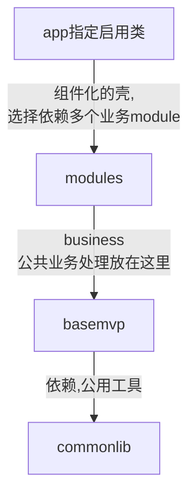
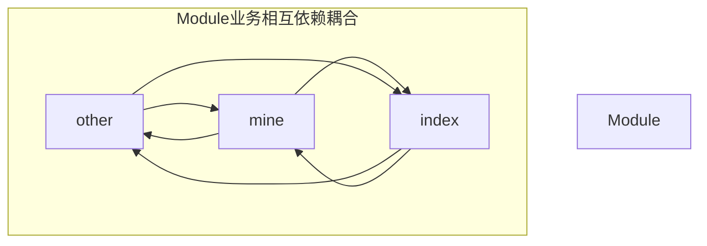
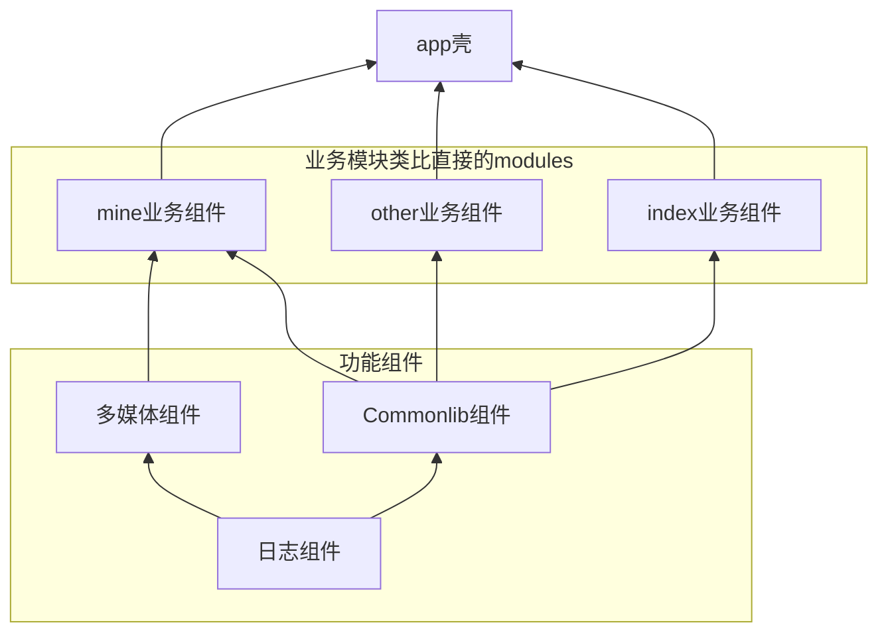

## 组件化mvp框架的搭建与介绍

### 原始的MVP框架 

 **大多项目示意结构图：**

**modules一般都是多个,而多个之间的业务是相互依赖的：**

项目结构
App层: 壳
Module层: index, mine, other
框架层: basemvp
工具依赖层: commonlib

> 这种模式使用起来大部分时候是没有问题的，但是在大项目与团队开发中module之间的高度耦合，一个module出现问题其他的也可能无法正常使用。设置在编译器，一个模块出现了问题，整个项目无法编过。于是乎就有了模块组件化的编程模式顺势而出。

### 组件化工程

**组件化工程模块模型**

**关于 `versioncode 与 name 1.1.1.001` 表示 主要大模块功能修改与添加.新版本更新.功能优化.测试版本次数**

**在这里业务模块直接是没有相互依赖的，是可配置的，一方出错，并不会影响另一方的运行与编译**

默认的 implementation 表示为模块自身添加依赖，如果需要扩展到整个项目，使用'api'关键字.还有其他相关依赖使用字段可以查看链接[Gradle指令]( https://www.jianshu.com/p/8ae94b825740 )

当一个module有问题的时候整体环境是无法编译过去的